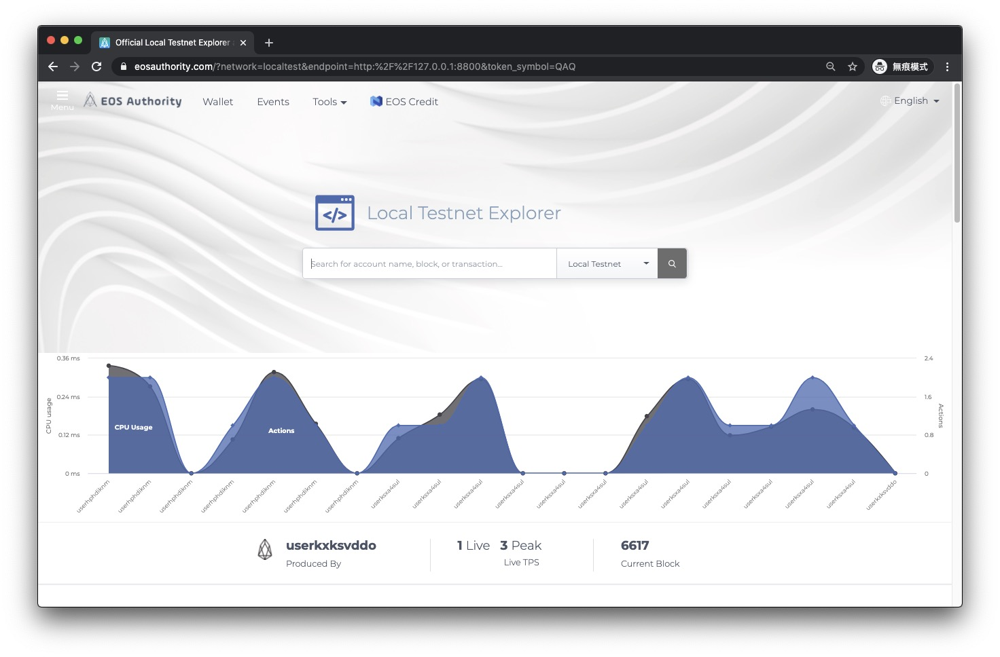

# Quick Start Guide

We provide two quick start script.

1. launch multi-node in one instance (same as [BIOS Boot Sequence](https://developers.eos.io/welcome/latest/tutorials/bios-boot-sequence), but we use shell script) 

```shell=
bash quick_start_multi.sh
```

2. launch single node in one instance and connect between instances

```shell=
bash quick_start.sh
```

# multi-node

## Use docker 

```shell=
docker run -d -it -p 8881:8080/tcp -p 8800:8800/tcp --name eos tony92151/eos_lab:official
```

then go to browser

http://localhost:8881

```shell=
cd
git clone https://github.com/Intelligent-Systems-Lab/EOS-lab-testnet.git

bash EOS-lab-testnet/quick_start_multi.sh

cleos -u http://localhost:8800 get info
```
and press [ENTER] to continue.

DONE

This script will create 25 nodes as producers. The first node 0000 will be genesis node. After the genesis node is launched and the system contract (nodes folder) set, we launch others nodes as producers (node0000~0024) and voters (node0025~0035).

All key pairs can be found [here](https://github.com/Intelligent-Systems-Lab/eos-keygen/blob/master/python/account_50.txt).

If you want to generate new keypairs yourself, check this [repo](https://github.com/Intelligent-Systems-Lab/eos-keygen).

### what's next?

Launch a script that can make transaction between nodes (0025~0035) automatically.

```shell==
bash EOS-lab-testnet/transaction_loop.sh
```

## Explorer

[EOS Aeosauthority](https://eosauthority.com/?network=localtest&endpoint=http:%2F%2F127.0.0.1:8800&token_symbol=QAQ) is a good tool for developer to check transation's information on browser.


