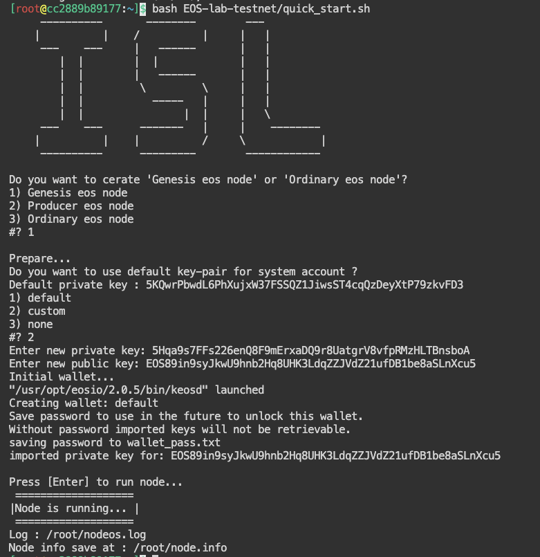

# Quick Srart Guide

## clone repo

```sheel=
git clone https://github.com/Intelligent-Systems-Lab/EOS-lab-testnet.git
```

## Use docker 

```shell=
# node1 v5
docker run -d -it -p 8881:8080/tcp -p 8891:8888/tcp --name eos1 tony92151/eos_lab:v5

# node2 v5
docker run -d -it -p 8882:8080/tcp -p 8892:8888/tcp --name eos2 tony92151/eos_lab:v5

# remove node1
docker container rm -f eos1
```
or use script
```shell=
# start node1 for v5
bash run_docker.sh run 1 v5

# remove node1
bash run_docker.sh rm 1
```

then go to browser

http://localhost:8881 for eos1

http://localhost:8882 for eos2

etc.

## Create Genesis eos node

`In docker container`

```shell=
bash EOS-lab-testnet/quick_start.sh
```
